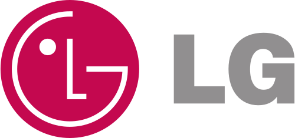
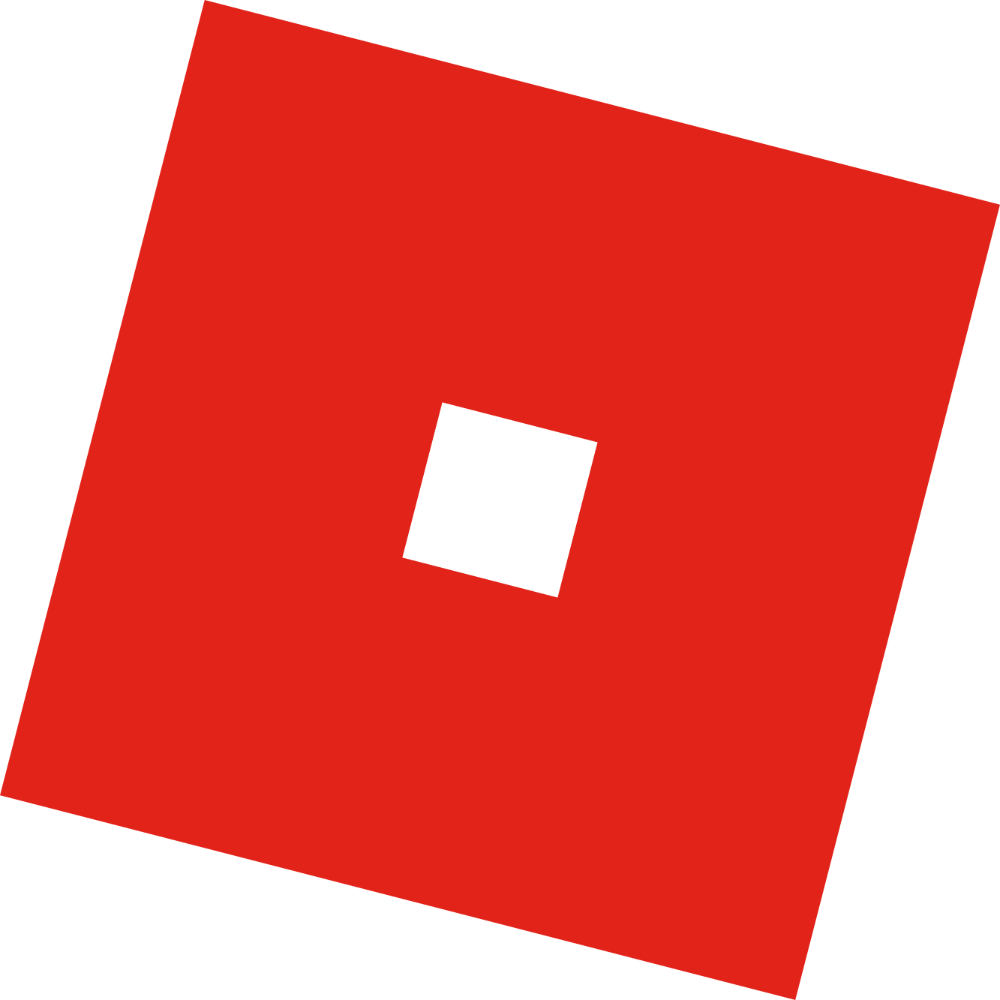

## Hello, I'm teaching programs for everyone.
- Currently I'm teaching students in SSAC, SBA.
- 2020 Goals: Start new business.

### Contact to me:
-  : comeduschool@gmail.com

### My skills and tools:
- Embedded Software : 

- Services:
 
 

 
 

- Data:

### Work with:

### My Lectures:
<!-- BLOG-POST_LIST:START -->
<!-- BLOG-POST_LIST:END -->
- [공공데이터를 활용한 빅데이터 분석](https://ssac.seoul.kr/course/course_view.jsp?id=22235&cid=5897&ch=course)